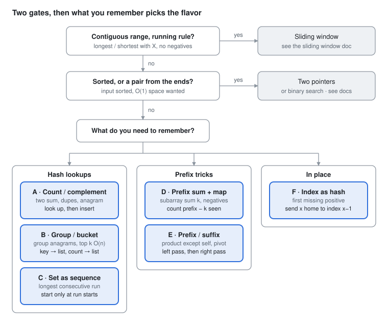

# DSA Prep - Arrays & Hashing

Oct 2, 2026 · Rohit Dhiman · [Source doc](https://claude.ai/artifact/X3Bp23WuNAgiPppjqYJ6GQ)

Trade O(n) memory for O(1) lookups: remember what you've seen so each element is touched once. Pick the flavor by **what you need to remember**.

## Spot it

<picture>
  <source media="(prefers-color-scheme: dark)" srcset="assets/arrays-and-hashing-spot-it-dark.svg">
  
</picture>

Rule out the window and pointer patterns first. Otherwise, what you need to remember picks A to F; strings route through the section near the end.

## The 6 flavors at a glance

| Flavor | Sounds like | What to store, then the key move | Practice |
| --- | --- | --- | --- |
| **A · Count / complement** | two sum<br>contains duplicate<br>valid anagram<br>ransom note | **Store:** value → count or index<br>**Move:** check `target - x` **before** inserting `x` | LC 1, 217, 242, 383, 454 |
| **B · Group / bucket** | group anagrams<br>top k frequent<br>sort by frequency | **Store:** canonical key → list, or count → list<br>**Move:** key from sorted chars or `int[26]` | LC 49, 249, 347, 451 |
| **C · Set as sequence** | longest consecutive<br>"in O(n)" | **Store:** `HashSet` of values<br>**Move:** start counting only where `x - 1` is absent | LC 128 |
| **D · Prefix sum + map** | subarray sum equals k<br>divisible by k<br>equal 0s and 1s<br>negatives allowed | **Store:** prefix sum → count (or first index)<br>**Move:** `res += count[prefix - k]` | LC 560, 974, 523, 525, 930 |
| **E · Prefix / suffix arrays** | product except self<br>pivot index<br>range sum query | **Store:** running sum / product from each side<br>**Move:** left pass, right pass, combine | LC 238, 724, 303, 42 |
| **F · Index as hash** | first missing positive<br>missing / duplicate in 1..n<br>O(1) space | **Store:** the array itself<br>**Move:** swap `x` to index `x - 1`, or sign-mark it | LC 41, 448, 442, 268 |

Top K with a heap lives in the Heap doc (A). Bucket (B here) is the O(n) alternative to mention.

## Templates

One spine: for each element, **look up first, then record**.

```
 for each x
     ask the map about x        ← complement? prefix - k? x - 1? its group?
     record x in the map        ← AFTER asking: no self-match
```

**A · Complement** (LC 1 Two Sum)

```java
Map<Integer, Integer> seen = new HashMap<>();          // value → index
for (int i = 0; i < nums.length; i++) {
    int need = target - nums[i];
    if (seen.containsKey(need)) return new int[]{seen.get(need), i};
    seen.put(nums[i], i);                               // insert AFTER checking
}
return new int[0];
```

**A+ · Frequency** (LC 242 Valid Anagram)

```java
if (s.length() != t.length()) return false;
int[] cnt = new int[26];
for (int i = 0; i < s.length(); i++) {
    cnt[s.charAt(i) - 'a']++;
    cnt[t.charAt(i) - 'a']--;
}
for (int c : cnt) if (c != 0) return false;
return true;
```

| Variant | Change |
| --- | --- |
| LC 217 duplicate | `if (!set.add(x)) return true;` |
| LC 383 ransom note | count magazine, decrement per note char, fail below 0 |
| LC 454 4Sum II | map of all `a + b` sums, then look up `-(c + d)` |

**B · Group by canonical key** (LC 49)

```java
Map<String, List<String>> groups = new HashMap<>();
for (String w : strs) {
    int[] cnt = new int[26];
    for (char c : w.toCharArray()) cnt[c - 'a']++;
    String key = Arrays.toString(cnt);                 // O(L); sorting chars is O(L log L)
    groups.computeIfAbsent(key, k -> new ArrayList<>()).add(w);
}
return new ArrayList<>(groups.values());
```

**B+ · Bucket by count** (LC 347 in O(n))

```java
Map<Integer, Integer> freq = new HashMap<>();
for (int x : nums) freq.merge(x, 1, Integer::sum);
List<Integer>[] bucket = new List[nums.length + 1];    // index = frequency
for (var e : freq.entrySet()) {
    int f = e.getValue();
    if (bucket[f] == null) bucket[f] = new ArrayList<>();
    bucket[f].add(e.getKey());
}
int[] res = new int[k];
int idx = 0;
for (int f = nums.length; f >= 1 && idx < k; f--) {
    if (bucket[f] == null) continue;
    for (int x : bucket[f]) if (idx < k) res[idx++] = x;
}
return res;
```

**C · Set as sequence** (LC 128)

```java
Set<Integer> set = new HashSet<>();
for (int x : nums) set.add(x);
int best = 0;
for (int x : set) {
    if (set.contains(x - 1)) continue;                 // not a run start: skip
    int len = 1;
    while (set.contains(x + len)) len++;
    best = Math.max(best, len);
}
return best;
```

**D · Prefix sum + map** (LC 560)

```
 nums   =    1   2   3            k = 3
 prefix = 0  1   3   6

 sum(i..j) = prefix[j+1] - prefix[i] = k   →   look up prefix - k
 at prefix 3: 3 - 3 = 0 seen once → [1, 2]
 at prefix 6: 6 - 3 = 3 seen once → [3]          answer = 2
```

```java
Map<Integer, Integer> count = new HashMap<>();
count.put(0, 1);                                        // the empty prefix
int prefix = 0, res = 0;
for (int x : nums) {
    prefix += x;
    res += count.getOrDefault(prefix - k, 0);           // earlier prefixes that leave sum k
    count.merge(prefix, 1, Integer::sum);
}
return res;
```

| Variant | Change |
| --- | --- |
| LC 974 divisible by k | key = `((prefix % k) + k) % k` |
| LC 523 multiple of k, length ≥ 2 | map remainder → FIRST index, seed `{0: -1}`, check `i - first >= 2` |
| LC 525 equal 0s and 1s | treat 0 as -1, map sum → first index, longest = `i - first` |

**E · Prefix / suffix** (LC 238, no division)

```java
int n = nums.length;
int[] res = new int[n];
res[0] = 1;
for (int i = 1; i < n; i++) res[i] = res[i - 1] * nums[i - 1];   // everything left
int right = 1;
for (int i = n - 1; i >= 0; i--) {
    res[i] *= right;                                            // times everything right
    right *= nums[i];
}
return res;
```

Range sum (LC 303): `pre[i + 1] = pre[i] + nums[i]`, then `sum(l..r) = pre[r + 1] - pre[l]`.

**F · Index as hash: cyclic sort** (LC 41)

```java
int n = nums.length;
for (int i = 0; i < n; i++) {
    while (nums[i] > 0 && nums[i] <= n && nums[nums[i] - 1] != nums[i]) {   // send x home to x-1
        int j = nums[i] - 1;
        int tmp = nums[i]; nums[i] = nums[j]; nums[j] = tmp;
    }
}
for (int i = 0; i < n; i++) if (nums[i] != i + 1) return i + 1;
return n + 1;
```

**F+ · Sign marking** (LC 448)

```java
for (int x : nums) {
    int i = Math.abs(x) - 1;
    if (nums[i] > 0) nums[i] = -nums[i];               // mark "i + 1 was seen"
}
List<Integer> res = new ArrayList<>();
for (int i = 0; i < nums.length; i++) if (nums[i] > 0) res.add(i + 1);
return res;
```

LC 268 missing number: XOR all indices and values, or `n(n+1)/2 - sum`.

## Java hashing cheat sheet

| Want | Java |
| --- | --- |
| Count occurrences | `map.merge(x, 1, Integer::sum)` |
| Read with a default | `map.getOrDefault(x, 0)` |
| List per key | `map.computeIfAbsent(key, k -> new ArrayList<>()).add(v)` |
| Add and detect duplicate | `if (!set.add(x)) /* duplicate */` |
| Lowercase letter counts | `int[26]`, index `c - 'a'` |
| Any ASCII char counts | `int[128]`, index `c` |
| Array or counts as a key | `Arrays.toString(cnt)` or `new String(sortedChars)`, never `int[]` itself |
| Pair as a key | `(long) a * 100_003 + b`, or `a + "," + b` |
| Compare two `Integer` values | `a.equals(b)` or unbox first, never `==` |

| Structure | Lookup | Use when |
| --- | --- | --- |
| `int[26]` / `int[128]` | O(1), no boxing | the key is a small char range |
| `HashMap` / `HashSet` | O(1) average, O(n) worst | anything else |
| `TreeMap` | O(log n) | you also need sorted keys, floor / ceiling |

**Complexity to say out loud:** one pass, O(n) time, O(n) extra space (O(1) for `int[26]` and flavor F).

## String-only techniques

Most string problems are another pattern in disguise. Route first; only the four techniques below are string-specific.

| String problem looks like | Go to |
| --- | --- |
| anagrams, char counts, isomorphic | this doc · A / B |
| longest / shortest substring with a condition | Sliding Window |
| palindrome check, reverse in place | Two Pointers · C |
| brackets, decode, remove adjacent | Stack · A / B |
| prefixes, dictionary, autocomplete | Trie |
| edit distance, LCS, word break | DP (future doc) |

**S1 · Expand around center** (LC 5 longest palindromic substring)

```
  odd center (c, c)      even center (c, c+1)
      b a b                  a b b a
        ↑                      ↑ ↑
   l ←     → r            l ←     → r        2n - 1 centers, O(n²) total, O(1) space
```

```java
int start = 0, len = 0;
for (int c = 0; c < s.length(); c++) {
    for (int[] lr : new int[][]{{c, c}, {c, c + 1}}) {        // odd and even centers
        int l = lr[0], r = lr[1];
        while (l >= 0 && r < s.length() && s.charAt(l) == s.charAt(r)) { l--; r++; }
        if (r - l - 1 > len) { len = r - l - 1; start = l + 1; }
    }
}
return s.substring(start, start + len);
// LC 647 count palindromes: count++ inside the while instead
```

**S2 · KMP** (LC 28 find needle: O(n + m))

```java
int n = s.length(), m = p.length();
int[] lps = new int[m];                       // longest proper prefix that is also a suffix
for (int i = 1, j = 0; i < m; i++) {
    while (j > 0 && p.charAt(i) != p.charAt(j)) j = lps[j - 1];
    if (p.charAt(i) == p.charAt(j)) j++;
    lps[i] = j;
}
for (int i = 0, j = 0; i < n; i++) {
    while (j > 0 && s.charAt(i) != p.charAt(j)) j = lps[j - 1];   // fall back, never move i back
    if (s.charAt(i) == p.charAt(j)) j++;
    if (j == m) return i - m + 1;             // match ends at i
}
return -1;
```

LC 459 repeated substring: `lps[m-1] > 0 && m % (m - lps[m-1]) == 0`. LC 187 repeated DNA: a `HashSet` of every length-10 substring is enough.

**S3 · Parsing with overflow guard** (LC 8 atoi)

```java
int i = 0, n = s.length(), sign = 1;
long val = 0;
while (i < n && s.charAt(i) == ' ') i++;
if (i < n && (s.charAt(i) == '+' || s.charAt(i) == '-')) sign = s.charAt(i++) == '-' ? -1 : 1;
while (i < n && Character.isDigit(s.charAt(i))) {
    val = val * 10 + (s.charAt(i++) - '0');
    if (sign * val > Integer.MAX_VALUE) return Integer.MAX_VALUE;
    if (sign * val < Integer.MIN_VALUE) return Integer.MIN_VALUE;
}
return (int) (sign * val);
```

**S4 · Encode / decode** (LC 271: length prefix survives any character)

```java
String encode(List<String> strs) {
    StringBuilder sb = new StringBuilder();
    for (String w : strs) sb.append(w.length()).append('#').append(w);
    return sb.toString();
}

List<String> decode(String s) {
    List<String> res = new ArrayList<>();
    int i = 0;
    while (i < s.length()) {
        int j = s.indexOf('#', i);                   // first '#' after the length
        int len = Integer.parseInt(s.substring(i, j));
        res.add(s.substring(j + 1, j + 1 + len));
        i = j + 1 + len;
    }
    return res;
}
```

| Char need | Java |
| --- | --- |
| Letter index / digit value | `c - 'a'` / `c - '0'` |
| Letter or digit? | `Character.isLetterOrDigit(c)` |
| Case-insensitive compare | `Character.toLowerCase(c)` |
| Build a string in a loop | `StringBuilder`, never `+=` |
| Compare strings | `a.equals(b)`, never `==` |

## Traps

| Trap | Symptom | Fix |
| --- | --- | --- |
| Two Sum: insert before checking | element paired with itself | check `target - x` first, then insert `x` |
| `int[]` as a HashMap key | groups never match (identity hash) | `Arrays.toString(cnt)` or a sorted-char `String` |
| `map.get(a) == map.get(b)` | false for values > 127 (Integer cache) | `.equals(...)` or unbox to `int` |
| Prefix sum without `count.put(0, 1)` | misses subarrays starting at index 0 | seed the empty prefix |
| `prefix % k` with negatives | Java gives -1, not k - 1 | `((p % k) + k) % k` |
| LC 128 without the run-start check | O(n²) | skip `x` when `x - 1` is in the set |
| LC 238 using division | breaks on zeros; not allowed anyway | prefix and suffix passes |
| Cyclic sort with `if` instead of `while` | items left out of place | `while` until `x` is home or out of range |
| Cyclic sort without the duplicate check | infinite swap loop | stop when `nums[x - 1] == x` |
| `s += c` in a loop | O(n²) time | `StringBuilder` |
| `s1 == s2` | false for equal content | `s1.equals(s2)` |
| atoi overflow | wraps to a wrong value | `long` accumulator, clamp each step |
| Encode with a plain delimiter | breaks when a word contains it | length prefix: `len + '#' + word` |
