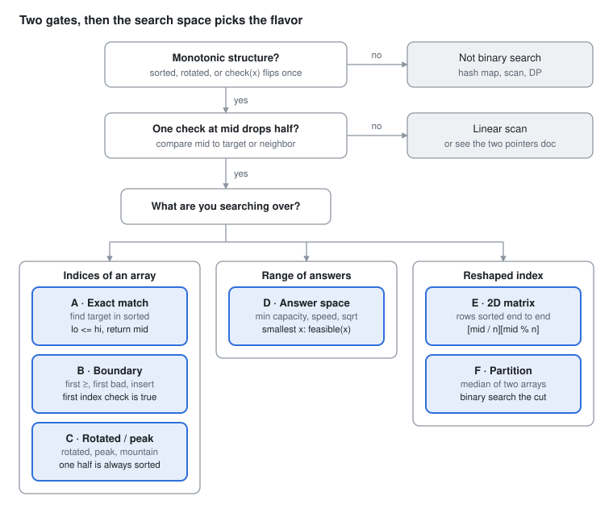

# DSA Prep - Binary Search

Oct 2, 2026 · Rohit Dhiman · [Source doc](https://claude.ai/artifact/4fydqV1JoFwWoKP7TZ6kL3)

Binary search finds where a monotonic check flips from false to true. Pick the flavor by **what you search over**.

## Spot it

<picture>
  <source media="(prefers-color-scheme: dark)" srcset="assets/binary-search-spot-it-dark.svg">
  
</picture>

No monotonic check means no binary search. With one, the search space picks A to F.

## The 6 flavors at a glance

| Flavor | Sounds like | Search space, then check(mid) | Practice |
| --- | --- | --- | --- |
| **A · Exact match** | find target in sorted array | **Space:** `[0, n-1]`<br>**Check:** `nums[mid] == target` | LC 704, 374 |
| **B · Boundary** | first / last position<br>insert position<br>first bad | **Space:** `[0, n]`<br>**Check:** `nums[mid] >= target` | LC 35, 34, 278, 744 |
| **C · Rotated / peak** | rotated sorted<br>peak<br>mountain | **Space:** `[0, n-1]`<br>**Check:** which half is sorted / uphill | LC 33, 153, 81, 162, 852 |
| **D · Answer space** | minimum capacity / speed<br>minimize the max<br>sqrt | **Space:** `[min answer, max answer]`<br>**Check:** `feasible(mid)` | LC 875, 1011, 410, 1482, 69 |
| **E · 2D matrix** | each row sorted, row starts > previous end | **Space:** `[0, m·n - 1]`<br>**Check:** `matrix[mid / n][mid % n]` | LC 74 |
| **F · Partition** | median of two sorted arrays<br>k-th of two | **Space:** cut `[0, m]` in shorter array<br>**Check:** left parts ≤ right parts | LC 4 |

LC 240 (rows and columns sorted, not end to end) is a staircase walk from the top-right, not binary search.

## Templates

Learn ONE spine: find the **first index where check is true**. Everything except exact match and rotated is this spine with a different `check`.

```
 index:  0     1     2     3     4     5
 check:  F     F     F     T     T     T
                           ↑
                     answer = lo

 lo = first candidate, hi = last candidate (or n if "none" is allowed)
 while (lo < hi)
     mid = lo + (hi - lo) / 2
     check(mid) ? hi = mid        ← mid may be the answer: keep it
                : lo = mid + 1    ← mid is not: drop it
 return lo
```

**Universal spine** (first true)

```java
int lo = 0, hi = n;                        // hi = n → "not found" returns n
while (lo < hi) {
    int mid = lo + (hi - lo) / 2;
    if (check(mid)) hi = mid;
    else lo = mid + 1;
}
return lo;
```

| Problem | lo, hi | check(mid) | Return |
| --- | --- | --- | --- |
| LC 35 insert position | `0, n` | `nums[mid] >= target` | `lo` |
| LC 34 first occurrence | `0, n` | `nums[mid] >= target` | `lo` if `nums[lo] == target` |
| LC 34 last occurrence | `0, n` | `nums[mid] > target` | `lo - 1` |
| LC 278 first bad | `1, n` | `isBadVersion(mid)` | `lo` |
| LC 153 min of rotated | `0, n-1` | `nums[mid] <= nums[n-1]` | `nums[lo]` |
| LC 162 peak | `0, n-1` | `nums[mid] > nums[mid+1]` | `lo` |
| LC 875 Koko | `1, max(piles)` | `hours(mid) <= h` | `lo` |
| LC 1011 ship capacity | `max(w), sum(w)` | `days(mid) <= D` | `lo` |

**A · Exact match** (closed range, `<=`)

```java
int lo = 0, hi = n - 1;
while (lo <= hi) {
    int mid = lo + (hi - lo) / 2;
    if (nums[mid] == target) return mid;
    if (nums[mid] < target) lo = mid + 1;
    else hi = mid - 1;
}
return -1;
```

**C · Rotated search** (LC 33: one half is always sorted)

```java
int lo = 0, hi = n - 1;
while (lo <= hi) {
    int mid = lo + (hi - lo) / 2;
    if (nums[mid] == target) return mid;
    if (nums[lo] <= nums[mid]) {                                   // left sorted
        if (nums[lo] <= target && target < nums[mid]) hi = mid - 1;
        else lo = mid + 1;
    } else {                                                       // right sorted
        if (nums[mid] < target && target <= nums[hi]) lo = mid + 1;
        else hi = mid - 1;
    }
}
return -1;
```

**D · Answer space** (spine + a `feasible` helper)

```java
int lo = minAnswer, hi = maxAnswer;
while (lo < hi) {
    int mid = lo + (hi - lo) / 2;
    if (feasible(mid)) hi = mid;        // smallest x that works
    else lo = mid + 1;
}
return lo;

// Koko (LC 875)
boolean feasible(int[] piles, int k, int h) {
    long hours = 0;
    for (int p : piles) hours += (p + k - 1) / k;   // ceil(p / k)
    return hours <= h;
}
```

Largest x that works ("maximize the min"): `mid = lo + (hi - lo + 1) / 2`, then `feasible(mid) ? lo = mid : hi = mid - 1`.

**E · 2D matrix** (LC 74: flatten the index)

```java
int lo = 0, hi = m * n - 1;
while (lo <= hi) {
    int mid = lo + (hi - lo) / 2;
    int val = matrix[mid / n][mid % n];
    if (val == target) return true;
    if (val < target) lo = mid + 1;
    else hi = mid - 1;
}
return false;
```

**F · Partition** (LC 4: binary search the cut in the shorter array A)

```java
int lo = 0, hi = m;                                    // m = A.length <= B.length
while (lo <= hi) {
    int i = lo + (hi - lo) / 2, j = (m + n + 1) / 2 - i;
    int aL = i == 0 ? Integer.MIN_VALUE : A[i - 1], aR = i == m ? Integer.MAX_VALUE : A[i];
    int bL = j == 0 ? Integer.MIN_VALUE : B[j - 1], bR = j == n ? Integer.MAX_VALUE : B[j];
    if (aL <= bR && bL <= aR) {
        if ((m + n) % 2 == 1) return Math.max(aL, bL);
        return (Math.max(aL, bL) + (double) Math.min(aR, bR)) / 2;
    }
    if (aL > bR) hi = i - 1;                           // cut too far right
    else lo = i + 1;
}
```

## Why halving is safe

The whole proof: check is **monotonic**. Once true, it stays true to the right.

| Flavor | Discard | Why it is safe |
| --- | --- | --- |
| A · Exact | the half that can't hold target | sorted: if `nums[mid] < target`, everything left of mid is smaller too |
| B · Boundary | `(mid, hi]` on true, `[lo, mid]` on false | true at mid → first true is at or before mid; false → it is after |
| C · Rotated | the half target can't be in | one half is always sorted, so a range check on it is exact |
| C · Peak | the downhill side | `nums[mid] < nums[mid+1]` → climbing right must reach a peak |
| D · Answer | answers below / above | `feasible(x)` true → `feasible(x+1)` true (more capacity never hurts) |
| E · 2D | half the flattened index | row-major order of such a matrix is one sorted array |
| F · Partition | cuts on the wrong side | `aL > bR` → cut in A is too far right; every cut further right is worse |

**Complexity:** O(log n) for A–C, E. D is O(n · log(range)): log steps, each `feasible` is O(n). F is O(log min(m, n)).

## Traps

| Trap | Symptom | Fix |
| --- | --- | --- |
| `(lo + hi) / 2` | int overflow at large bounds | `lo + (hi - lo) / 2` |
| `lo = mid` with floor mid | infinite loop at 2 elements | use ceil: `lo + (hi - lo + 1) / 2` |
| Mixing templates (`lo <= hi` with `hi = mid`) | infinite loop | `<` pairs with `hi = mid`; `<=` pairs with `hi = mid - 1` |
| `hi = n - 1` when "none" is possible | wrong answer past the end | `hi = n` for insert position / bounds |
| Trusting `lo` blindly | returns a non-match | check `lo < n && nums[lo] == target` |
| Answer-space bounds wrong | divide by zero, or too-small answer | Koko `lo = 1`; ship `lo = max(weights)`, `hi = sum` |
| `mid * mid`, sums in `feasible` | int overflow | use `long` |
| Rotated with duplicates (LC 81, 154) | can't tell which half is sorted | if `nums[lo] == nums[mid]`, `lo++`; worst case O(n) |

**30-second test before submit:** run the loop on `n = 1` and `n = 2`, target absent. If it ends, the boundaries are right.
