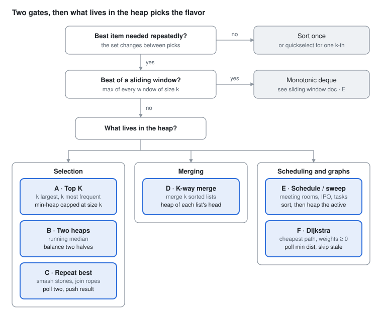

# DSA Prep - Heap / Priority Queue

Oct 2, 2026 · Rohit Dhiman · [Source doc](https://claude.ai/artifact/Cf2H35Gbww2LrXoidLFbrn)

A heap hands you the best item in O(log n), again and again, while the set changes. Pick the flavor by **what lives in the heap**.

## Spot it

<picture>
  <source media="(prefers-color-scheme: dark)" srcset="assets/heap-spot-it-dark.svg">
  
</picture>

One pick from a fixed set is a sort or quickselect; a window max is a deque. Otherwise, what lives in the heap picks A to F.

## The 6 flavors at a glance

| Flavor | Sounds like | What the heap holds, then its root | Practice |
| --- | --- | --- | --- |
| **A · Top K** | k largest / smallest<br>k most frequent / closest | **Holds:** the k best so far<br>**Root:** the weakest kept (evict it) | LC 215, 347, 973, 692, 703 |
| **B · Two heaps** | median of a stream<br>sliding window median | **Holds:** lower half + upper half<br>**Root:** max of low · min of high | LC 295, 480 |
| **C · Repeat best** | smash stones<br>connect sticks<br>min cost to combine | **Holds:** every item<br>**Root:** the next one to take | LC 1046, 1167, 2558, 1962 |
| **D · K-way merge** | merge k sorted<br>k-th smallest in sorted matrix<br>k smallest pairs | **Holds:** one head per list<br>**Root:** smallest head | LC 23, 378, 373, 632 |
| **E · Schedule / sweep** | meeting rooms<br>task scheduler<br>IPO<br>refueling | **Holds:** active or unlocked items<br>**Root:** earliest end, or best profit | LC 253, 621, 502, 871, 1834 |
| **F · Dijkstra** | cheapest / shortest path<br>weights ≥ 0 | **Holds:** (dist, node) frontier<br>**Root:** smallest dist | LC 743, 1631, 1514, 787 |

Rule of thumb: **order the heap so its root is the item you act on next**, whether you poll it to use it or poll it to evict it.

## Templates

One spine: seed, then poll the best and offer what it unlocks.

```
 pq = new PriorityQueue<>(comparator)     ← root = item you act on next
 seed pq
 while (pq not empty)
     best = pq.poll()                      O(log n)
     use best (or stop)
     pq.offer(whatever best unlocks)       O(log n)
```

**A · Top K** (LC 215: min-heap capped at k)

```java
PriorityQueue<Integer> pq = new PriorityQueue<>();      // root = weakest of the top k
for (int x : nums) {
    pq.offer(x);
    if (pq.size() > k) pq.poll();                       // evict the weakest
}
return pq.peek();                                        // k-th largest
```

**A+ · Top K frequent** (LC 347)

```java
Map<Integer, Integer> freq = new HashMap<>();
for (int x : nums) freq.merge(x, 1, Integer::sum);
PriorityQueue<int[]> pq = new PriorityQueue<>((a, b) -> Integer.compare(a[1], b[1]));   // {val, count}
for (var e : freq.entrySet()) {
    pq.offer(new int[]{e.getKey(), e.getValue()});
    if (pq.size() > k) pq.poll();
}
int[] res = new int[k];
for (int i = 0; i < k; i++) res[i] = pq.poll()[0];
return res;
```

| Want | Heap | Evict when |
| --- | --- | --- |
| k largest | min-heap | `size > k` |
| k smallest | max-heap | `size > k` |
| k closest points (LC 973) | max-heap by distance | `size > k` |
| k most frequent | min-heap by count | `size > k` |

**B · Two heaps** (LC 295: low may hold one extra)

```java
PriorityQueue<Integer> low = new PriorityQueue<>(Collections.reverseOrder());   // max-heap
PriorityQueue<Integer> high = new PriorityQueue<>();                             // min-heap
void addNum(int x) {
    low.offer(x);
    high.offer(low.poll());                              // keep every low ≤ every high
    if (high.size() > low.size()) low.offer(high.poll()); // rebalance sizes
}
double findMedian() {
    return low.size() > high.size() ? low.peek() : (low.peek() + (double) high.peek()) / 2;
}
```

**C · Repeat best** (LC 1046)

```java
PriorityQueue<Integer> pq = new PriorityQueue<>(Collections.reverseOrder());
for (int s : stones) pq.offer(s);
while (pq.size() > 1) {
    int a = pq.poll(), b = pq.poll();
    if (a != b) pq.offer(a - b);
}
return pq.isEmpty() ? 0 : pq.peek();
```

**D · K-way merge** (LC 23: heap of heads)

```java
PriorityQueue<ListNode> pq = new PriorityQueue<>((a, b) -> Integer.compare(a.val, b.val));
for (ListNode head : lists) if (head != null) pq.offer(head);
ListNode dummy = new ListNode(0), tail = dummy;
while (!pq.isEmpty()) {
    ListNode node = pq.poll();
    tail.next = node;
    tail = node;
    if (node.next != null) pq.offer(node.next);          // replace with its successor
}
return dummy.next;
```

**D+ · Sorted matrix** (LC 378: rows are the k lists)

```java
PriorityQueue<int[]> pq = new PriorityQueue<>((a, b) -> Integer.compare(a[0], b[0]));   // {val, r, c}
for (int r = 0; r < Math.min(n, k); r++) pq.offer(new int[]{matrix[r][0], r, 0});
for (int i = 0; i < k - 1; i++) {
    int[] cur = pq.poll();
    int r = cur[1], c = cur[2];
    if (c + 1 < n) pq.offer(new int[]{matrix[r][c + 1], r, c + 1});
}
return pq.peek()[0];
```

**E · Sweep** (LC 253 meeting rooms: sort by start, heap of end times)

```java
Arrays.sort(intervals, (a, b) -> Integer.compare(a[0], b[0]));
PriorityQueue<Integer> ends = new PriorityQueue<>();
for (int[] m : intervals) {
    if (!ends.isEmpty() && ends.peek() <= m[0]) ends.poll();   // reuse the room that frees first
    ends.offer(m[1]);
}
return ends.size();
```

**E+ · Unlock then take best** (LC 502 IPO)

```java
int n = profits.length;
int[][] proj = new int[n][];
for (int i = 0; i < n; i++) proj[i] = new int[]{capital[i], profits[i]};
Arrays.sort(proj, (a, b) -> Integer.compare(a[0], b[0]));
PriorityQueue<Integer> best = new PriorityQueue<>(Collections.reverseOrder());
int i = 0;
while (k-- > 0) {
    while (i < n && proj[i][0] <= w) best.offer(proj[i++][1]);   // unlock what's affordable
    if (best.isEmpty()) break;
    w += best.poll();
}
return w;
```

**F · Dijkstra** (LC 743)

```java
List<List<int[]>> g = new ArrayList<>();                         // g[u] = {v, w}
for (int i = 0; i <= n; i++) g.add(new ArrayList<>());
for (int[] t : times) g.get(t[0]).add(new int[]{t[1], t[2]});
int[] dist = new int[n + 1];
Arrays.fill(dist, Integer.MAX_VALUE);
dist[k] = 0;
PriorityQueue<int[]> pq = new PriorityQueue<>((a, b) -> Integer.compare(a[0], b[0]));   // {dist, node}
pq.offer(new int[]{0, k});
while (!pq.isEmpty()) {
    int[] cur = pq.poll();
    int d = cur[0], u = cur[1];
    if (d > dist[u]) continue;                                   // stale entry
    for (int[] e : g.get(u)) {
        int v = e[0], nd = d + e[1];
        if (nd < dist[v]) { dist[v] = nd; pq.offer(new int[]{nd, v}); }
    }
}
// answer: max over dist[1..n], or -1 if any stays MAX_VALUE
```

## Java PriorityQueue cheat sheet

```
 min-heap (default)            max-heap (reverseOrder)
        1                             9
      /   \                         /   \
     4     2                       7     8
    / \                           / \
   9   7                         1   4
 poll() → 1                    poll() → 9
```

| Want | Java |
| --- | --- |
| Min-heap of ints | `new PriorityQueue<>()` |
| Max-heap of ints | `new PriorityQueue<>(Collections.reverseOrder())` |
| By an array field | `new PriorityQueue<>((a, b) -> Integer.compare(a[0], b[0]))` |
| Field desc, tie asc | `(a, b) -> a[0] != b[0] ? Integer.compare(b[0], a[0]) : Integer.compare(a[1], b[1])` |
| Objects | `new PriorityQueue<>(Comparator.comparingInt(p -> p.cost))` |
| Heapify a list | `new PriorityQueue<>(list)` → O(n) |

| Operation | Cost |
| --- | --- |
| `offer` / `poll` | O(log n) |
| `peek` / `size` | O(1) |
| `remove(Object)` / `contains` | O(n): use lazy deletion instead |
| Iterating | NOT sorted order: poll in a loop |

**Complexity to say out loud:** n items through a heap capped at k → O(n log k) time, O(k) space. Dijkstra → O(E log V).

## Traps

| Trap | Symptom | Fix |
| --- | --- | --- |
| `(a, b) -> b - a` | overflow flips order for large or negative values | `Integer.compare(b, a)` |
| Top K with a heap of all n | O(n log n) time, O(n) memory | cap at k with the opposite heap (min-heap for k largest) |
| Iterating the queue to print sorted | wrong order | `poll()` in a loop |
| Removing arbitrary items (LC 480) | O(n) per `remove` | lazy deletion: count "to delete", skip when it reaches the top |
| Dijkstra without the stale check | TLE on dense graphs | `if (d > dist[u]) continue;` |
| Dijkstra with negative weights | wrong answer | Bellman-Ford; LC 787 needs a stops limit too |
| Meeting rooms boundary | one room too many | `ends.peek() <= start`: a room freed at t serves a start at t |
| Median sum `a + b` | int overflow | `(a + (double) b) / 2` |
| Offering null heads (LC 23) | NPE inside the comparator | skip `null` lists when seeding |
| `peek()` on empty into an `int` | NPE from unboxing | check `isEmpty()` first |
| LC 692 ties | wrong word order | count asc, then word **desc** in the min-heap (it's evicted first) |
