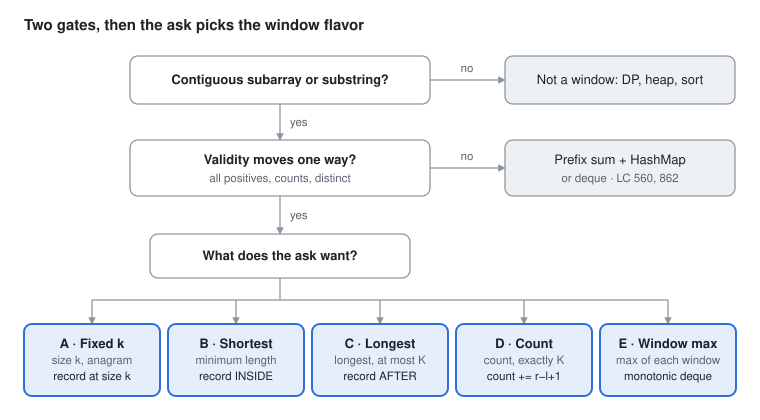

# DSA Prep - Sliding Window

Oct 2, 2026 · Rohit Dhiman · [Source doc](https://claude.ai/artifact/NCKByNJp9v2LaeZ5iuerfq)

Contiguous range + validity that changes in one direction = sliding window. Pick the flavor by **what you record and where**.

## Spot it

<picture>
  <source media="(prefers-color-scheme: dark)" srcset="assets/sliding-window-spot-it-dark.svg">
  
</picture>

Fail either gate and it is not a window. Pass both, and the ask's wording picks A to E.

## The 5 flavors at a glance

| Flavor | Sounds like | Shrink rule, then record | Practice |
| --- | --- | --- | --- |
| **A · Fixed size k** | size k<br>every window of k<br>permutation / anagram of p | **Shrink:** drop left once length hits k<br>**Record:** when length == k | LC 643, 1456, 567, 438 |
| **B · Shortest valid** | minimum length<br>smallest substring containing | **Shrink:** `while (VALID)`<br>**Record:** inside the while, before removing | LC 209, 76 |
| **C · Longest valid** | longest<br>at most K distinct / zeros / changes | **Shrink:** `while (INVALID)`<br>**Record:** after the while | LC 3, 424, 1004, 904 |
| **D · Count subarrays** | number of subarrays<br>exactly K | **Shrink:** `while (INVALID)`<br>**Record:** `count += right - left + 1` | LC 713, 992, 930, 1248 |
| **E · Window max/min** | max of each window<br>max − min ≤ limit | **Shrink:** deque front leaves the window<br>**Record:** `nums[dq.peekFirst()]` | LC 239, 1438 |

Exactly K = atMost(K) − atMost(K − 1).

## Templates

One spine. Only the shrink rule and the record line change.

```
 for right in 0..n-1        ← ALWAYS advances (unit of progress)
     add(right)
     [shrink rule]          ← A · B · C · D · E differ here
     [record]               ← ...and here (inside vs after the shrink)
```

**A · Fixed size k**

```java
int left = 0;
for (int right = 0; right < n; right++) {
    add(right);
    if (right - left + 1 == k) {
        record();
        remove(left++);
    }
}
```

**B · Shortest valid** (record INSIDE)

```java
int left = 0, best = Integer.MAX_VALUE;
for (int right = 0; right < n; right++) {
    add(right);
    while (valid()) {
        best = Math.min(best, right - left + 1);
        remove(left++);
    }
}
return best == Integer.MAX_VALUE ? 0 : best;
```

**C · Longest valid** (record AFTER)

```java
int left = 0, best = 0;
for (int right = 0; right < n; right++) {
    add(right);
    while (!valid()) remove(left++);
    best = Math.max(best, right - left + 1);
}
return best;
```

**D · Count subarrays** (C + count every window ending at right)

```java
int atMost(int[] nums, int k) {
    if (k < 0) return 0;
    int left = 0, count = 0;
    for (int right = 0; right < nums.length; right++) {
        add(right);
        while (!valid(k)) remove(left++);
        count += right - left + 1;
    }
    return count;
}
// exactly(k) = atMost(nums, k) - atMost(nums, k - 1)
```

**E · Window max** (monotonic deque of indices, values decreasing)

```java
Deque<Integer> dq = new ArrayDeque<>();
for (int right = 0; right < n; right++) {
    while (!dq.isEmpty() && nums[dq.peekLast()] <= nums[right]) dq.pollLast();
    dq.offerLast(right);
    if (dq.peekFirst() <= right - k) dq.pollFirst();        // fell out
    if (right >= k - 1) res[right - k + 1] = nums[dq.peekFirst()];
}
```

Window min: flip `<=` to `>=`.

## Window state

Plug these into `add` / `remove` / `valid` in the templates.

| Track | State | add(r) / remove(l) | Valid when | Used in |
| --- | --- | --- | --- | --- |
| Sum | `int sum` | `sum += x` / `sum -= x` | `sum >= target` | 209 · 643 |
| Product | `int prod` | `prod *= x` / `prod /= x` | `prod < k` (return 0 if `k <= 1`) | 713 |
| Bad items | `int bad` | `if (x == 0) bad++` / `bad--` | `bad <= k` | 1004 · 1493 |
| Distinct | `int[128] cnt` + `int distinct` | `if (cnt[c]++ == 0) distinct++` / `if (--cnt[c] == 0) distinct--` | `distinct <= k` | 3 · 904 · 992 |
| Most frequent | `int[26] cnt` + `int maxFreq` | `maxFreq = max(maxFreq, ++cnt[c])` / `cnt[c]--` | `len - maxFreq <= k` | 424 |
| Cover string t | `int[128] need` + `int missing` | `if (need[c]-- > 0) missing--` / `if (++need[c] > 0) missing++` | `missing == 0` | 76 · 567 · 438 |
| Max / min | `Deque<Integer>` of indices | template E | front in range | 239 · 1438 |

`int[128]` beats `HashMap` for chars: no boxing, O(1), fewer lines.

## Traps

| Trap | Symptom | Fix |
| --- | --- | --- |
| `if (valid) shrink else expand` | double-adds, infinite loop, last window never checked | `for` on right; shrink inside it |
| `j++` right after add | window size off by one | right stays inside the window: size = `right - left + 1` |
| `while (... && left < right)` | size-1 windows never recorded | drop it; empty window is never valid when target ≥ 1 |
| `if` instead of `while` to shrink | window stays too big | one add can force many removals |
| Negatives in input | shrinking no longer lowers the sum | not a window: prefix sum + HashMap (LC 560) or monotonic deque (LC 862) |
| `i` = right, `j` = left | reviewer pauses on `i - j + 1` | name them `left` / `right` |

**Defend O(n):** each index enters once and leaves at most once, so ≤ 2n steps.
