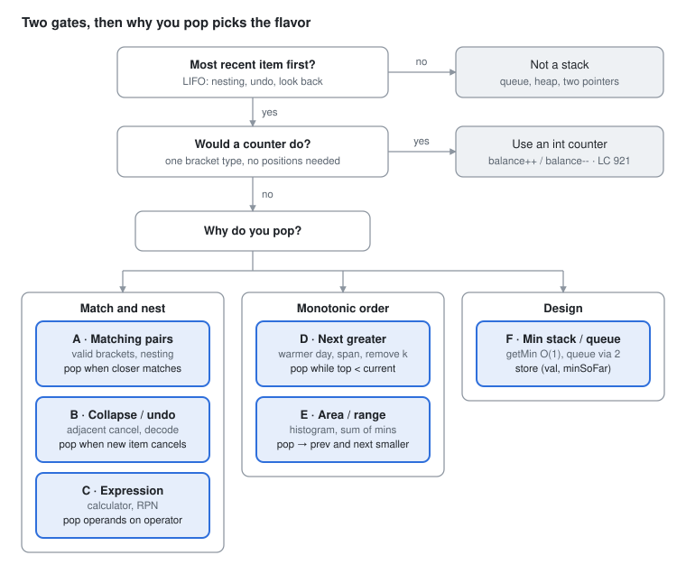

# DSA Prep - Stack

Oct 2, 2026 · Rohit Dhiman · [Source doc](https://claude.ai/artifact/Nk5P2kCSFzpiQZeNWfkRzh)

A stack resolves the most recent unresolved item first. Pick the flavor by **why you pop**.

## Spot it

<picture>
  <source media="(prefers-color-scheme: dark)" srcset="assets/stack-spot-it-dark.svg">
  
</picture>

No LIFO need means no stack; a single counter beats a stack when positions don't matter. Otherwise, why you pop picks A to F.

## The 6 flavors at a glance

| Flavor | Sounds like | What the stack holds, then when to pop | Practice |
| --- | --- | --- | --- |
| **A · Matching pairs** | valid parentheses<br>min removals<br>longest valid | **Holds:** expected closers (or indices)<br>**Pop:** closer matches top | LC 20, 1249, 32 |
| **B · Collapse / undo** | remove adjacent<br>simplify path<br>collision<br>decode | **Holds:** chars, tokens, (count, string)<br>**Pop:** new item cancels top | LC 1047, 71, 735, 394, 844 |
| **C · Expression** | basic calculator<br>evaluate RPN | **Holds:** numbers (signed)<br>**Pop:** an operator arrives | LC 150, 227, 224 |
| **D · Next greater / smaller** | next greater<br>days until warmer<br>stock span<br>remove k digits | **Holds:** indices, values decreasing<br>**Pop:** current beats top → top's answer = current | LC 739, 496, 503, 901, 402, 316 |
| **E · Area / range** | largest rectangle<br>sum of subarray minimums | **Holds:** indices, values increasing<br>**Pop:** current < top → popped bar spans (new top, current) | LC 84, 85, 907, 42 |
| **F · Design** | getMin in O(1)<br>queue using stacks | **Holds:** (val, minSoFar) pairs · in + out stacks<br>**Pop:** — | LC 155, 232 |

In Java, use `ArrayDeque` (`push` / `pop` / `peek`), never the legacy `Stack` class.

## Templates

One spine. Only the pop rule and what you record on pop change.

```
 for each item x, left to right
     while (stack not empty && rule(top, x))   ← A–E differ here
         pop → resolve / record                ← ...and here
     push x (or its index)
 after the loop: handle leftovers             ← unmatched, no-greater, flush
```

**A · Matching pairs** (push the expected closer)

```java
Deque<Character> st = new ArrayDeque<>();
for (char c : s.toCharArray()) {
    if (c == '(') st.push(')');
    else if (c == '[') st.push(']');
    else if (c == '{') st.push('}');
    else if (st.isEmpty() || st.pop() != c) return false;
}
return st.isEmpty();
```

**B · Collapse** (LC 1047: StringBuilder as the stack)

```java
StringBuilder sb = new StringBuilder();
for (char c : s.toCharArray()) {
    int len = sb.length();
    if (len > 0 && sb.charAt(len - 1) == c) sb.deleteCharAt(len - 1);   // cancel
    else sb.append(c);
}
return sb.toString();
```

**B+ · Nested decode** (LC 394: push the outer state on `[`)

```java
Deque<Integer> counts = new ArrayDeque<>();
Deque<StringBuilder> outer = new ArrayDeque<>();
StringBuilder cur = new StringBuilder();
int k = 0;
for (char c : s.toCharArray()) {
    if (Character.isDigit(c)) k = k * 10 + (c - '0');
    else if (c == '[') { counts.push(k); outer.push(cur); cur = new StringBuilder(); k = 0; }
    else if (c == ']') { String inner = cur.toString(); cur = outer.pop(); cur.append(inner.repeat(counts.pop())); }
    else cur.append(c);
}
return cur.toString();
```

**C · Expression** (LC 227: `+ - * /`, no parentheses)

```java
Deque<Integer> st = new ArrayDeque<>();
int num = 0; char op = '+';
for (int i = 0; i < s.length(); i++) {
    char c = s.charAt(i);
    if (Character.isDigit(c)) num = num * 10 + (c - '0');
    if ((!Character.isDigit(c) && c != ' ') || i == s.length() - 1) {
        if (op == '+') st.push(num);
        else if (op == '-') st.push(-num);
        else if (op == '*') st.push(st.pop() * num);
        else st.push(st.pop() / num);
        op = c; num = 0;
    }
}
int res = 0;
for (int v : st) res += v;
return res;
```

**C+ · RPN** (LC 150: pop b first, then a)

```java
Deque<Integer> st = new ArrayDeque<>();
for (String t : tokens) {
    switch (t) {
        case "+" -> st.push(st.pop() + st.pop());
        case "*" -> st.push(st.pop() * st.pop());
        case "-" -> { int b = st.pop(), a = st.pop(); st.push(a - b); }
        case "/" -> { int b = st.pop(), a = st.pop(); st.push(a / b); }
        default  -> st.push(Integer.parseInt(t));
    }
}
return st.pop();
```

**D · Next greater** (LC 739: stack of indices, values decreasing)

```java
int[] ans = new int[n];
Deque<Integer> st = new ArrayDeque<>();
for (int i = 0; i < n; i++) {
    while (!st.isEmpty() && t[st.peek()] < t[i]) {
        int j = st.pop();
        ans[j] = i - j;                 // i is j's next greater
    }
    st.push(i);
}
return ans;                             // leftovers: no greater → stays 0
```

| Variant | Change |
| --- | --- |
| Next smaller | flip `<` to `>` |
| Previous greater | after the while, answer for `i` = `st.peek()` (or none) |
| Circular (LC 503) | loop `i` over `0..2n-1`, use `i % n`, push only when `i < n` |
| Remove k digits (LC 402) | pop while `k > 0 && top > digit`, `k--`; trim leftover k from the end; strip leading zeros; empty → `"0"` |

**E · Area / range** (LC 84: increasing stack + sentinel)

```java
Deque<Integer> st = new ArrayDeque<>();
int best = 0;
for (int i = 0; i <= n; i++) {
    int h = (i == n) ? 0 : heights[i];              // sentinel 0 flushes the stack
    while (!st.isEmpty() && heights[st.peek()] > h) {
        int height = heights[st.pop()];
        int left = st.isEmpty() ? -1 : st.peek();   // previous smaller
        best = Math.max(best, height * (i - left - 1)); // i = next smaller
    }
    st.push(i);
}
return best;
```

**F · Min stack** (LC 155)

```java
Deque<int[]> st = new ArrayDeque<>();           // {val, minSoFar}
void push(int x) { st.push(new int[]{x, st.isEmpty() ? x : Math.min(x, st.peek()[1])}); }
void pop()       { st.pop(); }
int top()        { return st.peek()[0]; }
int getMin()     { return st.peek()[1]; }
```

**F+ · Queue via two stacks** (LC 232: amortized O(1))

```java
Deque<Integer> in = new ArrayDeque<>(), out = new ArrayDeque<>();
void push(int x) { in.push(x); }
int pop()        { peek(); return out.pop(); }
int peek() {
    if (out.isEmpty()) while (!in.isEmpty()) out.push(in.pop());   // refill only when empty
    return out.peek();
}
```

## Why popping is safe

| Flavor | What a pop means | Why it is safe |
| --- | --- | --- |
| A · Matching | top is closed for good | nesting: the most recent open must close before any older one |
| B · Collapse | the pair is gone | a cancelled pair can't affect anything; the next check is against the new top |
| C · Expression | `*` `/` applied now | they bind tighter; `+` `-` wait as signed numbers summed at the end |
| D · Next greater | top found its answer | it is the FIRST greater to its right; nothing later can be closer |
| E · Area | popped bar's range is final | new top = its previous smaller, current = its next smaller → widest possible span |
| F · Min stack | min restores itself | each entry stored the min of everything beneath it |

**Complexity:** each element is pushed once and popped at most once → O(n) total, despite the nested `while`.

## Traps

| Trap | Symptom | Fix |
| --- | --- | --- |
| `pop()` / `peek()` on empty | NoSuchElementException / NPE | check `isEmpty()` first (an unmatched closer = invalid) |
| Ignoring leftovers | `"(("` reported valid; bars never measured | A: `return st.isEmpty()` · E: sentinel `0` at `i == n` |
| Pushing values when you need distance | can't compute days / width | push indices; read values via `arr[st.peek()]` |
| Duplicates with `<` vs `<=` | double count (LC 907) or wrong span | one side strict, the other non-strict |
| RPN operand order | wrong `a - b`, `a / b` | pop `b` first, then `a` |
| Calculator's last number | final term dropped | process when `i == s.length() - 1` |
| Multi-digit numbers | `12` read as `1`, `2` | `num = num * 10 + (c - '0')` |
| Remove k digits leftovers | wrong length, `"0200"` | trim remaining k from the end, strip leading zeros, empty → `"0"` |
| `java.util.Stack` | slow, synchronized, legacy | `ArrayDeque` |
