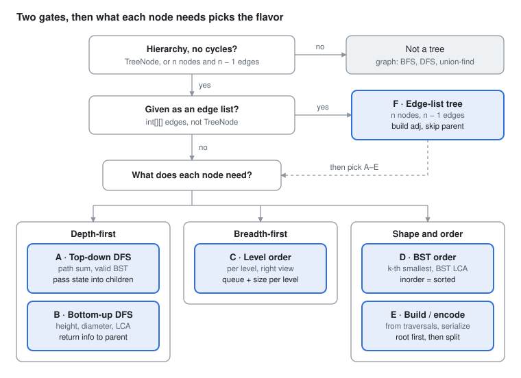

# DSA Prep - Trees

Oct 2, 2026 · Rohit Dhiman · [Source doc](https://claude.ai/artifact/Bj3RsF6vSBPGbifpK6pG4f)

Every tree problem asks one question: what does each node need, and from where? Pick the flavor by **which way information flows**.

## Spot it

<picture>
  <source media="(prefers-color-scheme: dark)" srcset="assets/trees-spot-it-dark.svg">
  
</picture>

An edge list is just F's setup step: build adj, then pick A to E as for any tree.

## The 6 flavors at a glance

| Flavor | Sounds like | How info flows, then the traversal | Practice |
| --- | --- | --- | --- |
| **A · Top-down DFS** | root-to-leaf path<br>path sum<br>valid BST<br>good nodes | **Flows:** parent → child (params)<br>**Traversal:** preorder | LC 112, 113, 129, 98, 1448 |
| **B · Bottom-up DFS** | height<br>diameter<br>balanced<br>max path sum<br>LCA | **Flows:** child → parent (return value)<br>**Traversal:** postorder | LC 104, 110, 543, 124, 236 |
| **C · Level order** | level by level<br>right side view<br>zigzag<br>min depth | **Flows:** across one level<br>**Traversal:** BFS + queue | LC 102, 199, 103, 111, 637 |
| **D · BST order** | BST<br>k-th smallest<br>closest value<br>LCA of BST | **Flows:** left < node < right<br>**Traversal:** inorder / walk down | LC 230, 235, 700, 450 |
| **E · Build / encode** | construct from traversals<br>serialize<br>sorted array to BST | **Flows:** root first, then split ranges<br>**Traversal:** preorder | LC 105, 106, 108, 297 |
| **F · Edge-list tree** | n nodes, n − 1 edges<br>edges[i] = [a, b] | **Flows:** any of A–E after building adj<br>**Traversal:** DFS with parent param | LC 2467, 1443, 2368, 1466, 834 |

All code below assumes LeetCode's `TreeNode { int val; TreeNode left, right; }`.

## Templates

Two DFS directions cover most problems. Ask: does the node need something from **above** (pass it down) or from **below** (return it up)?

```
 TOP-DOWN (A)                     BOTTOM-UP (B)
 state flows ↓ as params          answer flows ↑ as return value

        root  state=s                    root  = f(L, R)
       ↙    ↘                           ↗    ↖
   s'          s'                    L            R

 act BEFORE recursing             act AFTER recursing
 answer at leaves / global        answer at root / global
```

**A · Top-down** (LC 112: pass the remaining target down)

```java
boolean hasPathSum(TreeNode node, int remain) {
    if (node == null) return false;
    remain -= node.val;
    if (node.left == null && node.right == null) return remain == 0;   // leaf
    return hasPathSum(node.left, remain) || hasPathSum(node.right, remain);
}
```

**A+ · Bounds** (LC 98: validate BST)

```java
boolean valid(TreeNode node, long lo, long hi) {
    if (node == null) return true;
    if (node.val <= lo || node.val >= hi) return false;
    return valid(node.left, lo, node.val) && valid(node.right, node.val, hi);
}
// call: valid(root, Long.MIN_VALUE, Long.MAX_VALUE)
```

**A++ · Collect paths** (LC 113: backtrack the path list)

```java
void dfs(TreeNode node, int remain, List<Integer> path, List<List<Integer>> res) {
    if (node == null) return;
    path.add(node.val);
    remain -= node.val;
    if (node.left == null && node.right == null && remain == 0) res.add(new ArrayList<>(path));
    dfs(node.left, remain, path, res);
    dfs(node.right, remain, path, res);
    path.remove(path.size() - 1);                    // backtrack
}
```

**B · Bottom-up** (LC 543 diameter: return one thing, update a global with another)

```java
int best = 0;
int height(TreeNode node) {
    if (node == null) return 0;
    int l = height(node.left), r = height(node.right);
    best = Math.max(best, l + r);                    // path BENDING through node
    return 1 + Math.max(l, r);                       // path CONTINUING up
}
```

| Problem | Return up | Global update |
| --- | --- | --- |
| LC 104 max depth | `1 + max(l, r)` | — |
| LC 110 balanced | `-1` if unbalanced, else height | — |
| LC 543 diameter | `1 + max(l, r)` | `l + r` |
| LC 124 max path sum | `val + max(l, r)`, with `l, r` clamped at 0 | `val + l + r` (start at `MIN_VALUE`) |

**B+ · LCA** (LC 236)

```java
TreeNode lca(TreeNode node, TreeNode p, TreeNode q) {
    if (node == null || node == p || node == q) return node;
    TreeNode l = lca(node.left, p, q), r = lca(node.right, p, q);
    if (l != null && r != null) return node;         // p and q split here
    return l != null ? l : r;
}
```

**C · Level order** (LC 102: freeze the level size)

```java
List<List<Integer>> res = new ArrayList<>();
if (root == null) return res;
Deque<TreeNode> q = new ArrayDeque<>();
q.offer(root);
while (!q.isEmpty()) {
    int size = q.size();                             // this level only
    List<Integer> level = new ArrayList<>();
    for (int i = 0; i < size; i++) {
        TreeNode node = q.poll();
        level.add(node.val);
        if (node.left != null) q.offer(node.left);
        if (node.right != null) q.offer(node.right);
    }
    res.add(level);
}
return res;
```

| Variant | Change |
| --- | --- |
| LC 199 right view | record `node.val` when `i == size - 1` |
| LC 103 zigzag | reverse `level` on odd levels |
| LC 111 min depth | return depth at the first leaf polled |
| LC 637 averages | sum the level, divide by `size` |

**D · BST inorder** (LC 230: k-th smallest, iterative)

```java
Deque<TreeNode> st = new ArrayDeque<>();
TreeNode cur = root;
while (cur != null || !st.isEmpty()) {
    while (cur != null) { st.push(cur); cur = cur.left; }   // go all the way left
    cur = st.pop();
    if (--k == 0) return cur.val;                           // visited in sorted order
    cur = cur.right;
}
return -1;
```

**D+ · Walk the BST** (LC 235: LCA in O(h), no recursion)

```java
TreeNode cur = root;
while (cur != null) {
    if (p.val < cur.val && q.val < cur.val) cur = cur.left;
    else if (p.val > cur.val && q.val > cur.val) cur = cur.right;
    else return cur;                                 // split point
}
return null;
```

**E · Build from preorder + inorder** (LC 105)

```java
Map<Integer, Integer> idx = new HashMap<>();         // value → inorder index
int pre = 0;
TreeNode build(int[] preorder, int lo, int hi) {     // inorder range [lo, hi]
    if (lo > hi) return null;
    TreeNode root = new TreeNode(preorder[pre++]);
    int mid = idx.get(root.val);
    root.left = build(preorder, lo, mid - 1);        // left first: matches preorder
    root.right = build(preorder, mid + 1, hi);
    return root;
}
// fill idx from inorder, then build(preorder, 0, n - 1)
```

**E+ · Sorted array to BST** (LC 108)

```java
TreeNode build(int[] a, int lo, int hi) {
    if (lo > hi) return null;
    int mid = lo + (hi - lo) / 2;
    TreeNode node = new TreeNode(a[mid]);
    node.left = build(a, lo, mid - 1);
    node.right = build(a, mid + 1, hi);
    return node;
}
```

**E++ · Serialize** (LC 297: preorder with null markers)

```java
void ser(TreeNode node, StringBuilder sb) {
    if (node == null) { sb.append("#,"); return; }
    sb.append(node.val).append(',');
    ser(node.left, sb);
    ser(node.right, sb);
}
TreeNode des(Deque<String> tokens) {     // new ArrayDeque<>(Arrays.asList(data.split(",")))
    String t = tokens.poll();
    if (t.equals("#")) return null;
    TreeNode node = new TreeNode(Integer.parseInt(t));
    node.left = des(tokens);
    node.right = des(tokens);
    return node;
}
```

**F · Edge-list tree** (build adj once, then reuse A–E)

```
 Pointer tree                      Edge-list tree
 node.left / node.right      →     adj.get(node)
 null check                  →     skip child == parent
 leaf: no children           →     node != root && adj.get(node).size() == 1
 depth via recursion         →     same, pass depth + 1
```

```java
// T1: adjacency list
List<List<Integer>> adj = new ArrayList<>();
for (int i = 0; i < n; i++) adj.add(new ArrayList<>());
for (int[] e : edges) {
    adj.get(e[0]).add(e[1]);
    adj.get(e[1]).add(e[0]);
}

// T2: parent[] via BFS from root 0 (no recursion; path between two nodes = walk up)
int[] parent = new int[n];
parent[0] = -1;
Deque<Integer> q = new ArrayDeque<>();
q.offer(0);
while (!q.isEmpty()) {
    int cur = q.poll();
    for (int nb : adj.get(cur)) {
        if (nb == parent[cur]) continue;             // skip the PARENT, not cur
        parent[nb] = cur;
        q.offer(nb);
    }
}

// T3: DFS with a parent param (replaces visited[])
int dfs(int node, int par, int depth) {
    int bestBelow = Integer.MIN_VALUE;
    for (int child : adj.get(node)) {
        if (child == par) continue;
        bestBelow = Math.max(bestBelow, dfs(child, node, depth + 1));
    }
    int mine = /* this node's value */ 0;
    return bestBelow == Integer.MIN_VALUE ? mine : mine + bestBelow;   // leaf: no overflow
}
```

## F deep dive: trees given as edges

There is no `null`. The loop that skips the parent **is** the base case; a leaf is a loop that runs zero times.

### F1 · Side by side: TreeNode vs edge list

| TreeNode | Edge list |
| --- | --- |
| `if (node == null) return BASE;` | no null check: skip `child == par`; a leaf's loop runs zero times |
| `l = f(left); r = f(right);` | `for (child : adj.get(node))` and fold with max / sum |
| `l + r` (bend through node) | keep the **top two** children: nodes can have many |
| root is given | root is your choice: usually 0, or as the problem states |
| `node.val` | `values[node]`, `amount[node]` |

**Top-down** (max depth, passed down)

```java
// TreeNode
void dfs(TreeNode node, int depth) {
    if (node == null) return;
    best = Math.max(best, depth);
    dfs(node.left, depth + 1);
    dfs(node.right, depth + 1);
}

// Edge list
void dfs(int node, int par, int depth) {
    best = Math.max(best, depth);
    for (int child : adj.get(node)) {
        if (child == par) continue;
        dfs(child, node, depth + 1);
    }
}
```

**Bottom-up** (height, returned up)

```java
// TreeNode
int height(TreeNode node) {
    if (node == null) return 0;
    return 1 + Math.max(height(node.left), height(node.right));
}

// Edge list
int height(int node, int par) {
    int h = 0;                                   // neutral start: leaf returns 1
    for (int child : adj.get(node)) {
        if (child == par) continue;
        h = Math.max(h, height(child, node));
    }
    return 1 + h;
}
```

Neutral start beats a sentinel: use `0` when values can't be negative. Values can be negative (LC 2467 income) → `MIN_VALUE` + the leaf check.

**Diameter** (top two children instead of left and right)

```java
int best = 0;
int down(int node, int par) {                     // longest downward path, in edges
    int top1 = 0, top2 = 0;
    for (int child : adj.get(node)) {
        if (child == par) continue;
        int d = 1 + down(child, node);
        if (d > top1) { top2 = top1; top1 = d; }
        else if (d > top2) top2 = d;
    }
    best = Math.max(best, top1 + top2);           // bend through node
    return top1;                                  // continue up
}
```

### F2 · Recursion-free DP over BFS order

BFS from the root lists every parent before its children. Walk that list **forward** for top-down, **backward** for bottom-up. No recursion means no stack overflow at n = 1e5.

```
        0
        │              order = [0, 1, 2, 3, 4]
        1
       ╱ ╲             forward  ────────►  parent done before child (top-down)
      2   3            backward ◄────────  children done before parent (bottom-up)
          │
          4
```

**T2+ · BFS that also records order and depth**

```java
int[] parent = new int[n], order = new int[n], depth = new int[n];
parent[0] = -1;
int head = 0, tail = 0;
order[tail++] = 0;                          // the array IS the queue
while (head < tail) {
    int cur = order[head++];
    for (int nb : adj.get(cur)) {
        if (nb == parent[cur]) continue;
        parent[nb] = cur;
        depth[nb] = depth[cur] + 1;
        order[tail++] = nb;
    }
}
```

**Top-down: forward pass** (sum from root to each node)

```java
long[] fromRoot = new long[n];
for (int i = 0; i < n; i++) {
    int v = order[i];
    fromRoot[v] = (parent[v] == -1 ? 0 : fromRoot[parent[v]]) + val[v];
}
```

**Bottom-up: backward pass** (subtree sizes)

```java
int[] size = new int[n];
for (int i = n - 1; i >= 0; i--) {
    int v = order[i];
    size[v] += 1;                                // count itself
    if (parent[v] != -1) size[parent[v]] += size[v];   // hand total to parent
}
```

Any bottom-up rule works the same way: finish `v` completely, then fold it into `parent[v]`.

### F3 · Path between two nodes and LCA

`parent[]` is a linked list toward the root; `-1` is its `null`. Walking up is the whole trick.

```
 parent = [-1, 0, 1, 1, 3]        walk up from 4:
                                  4 → 3 → 1 → 0 → -1 (stop)
        0                         t: 0   1   2   3
        │
        1                         LCA(2, 4):
       ╱ ╲                          depth[4]=3 > depth[2]=2 → lift 4 to 3
      2   3                         2 ≠ 3 → both up → 1 == 1 ✓
          │
          4
```

**Walk up** (Bob's path in LC 2467)

```java
int node = x, t = 0;
while (node != -1) {
    /* node is reached at time t */
    node = parent[node];
    t++;
}
```

**LCA with depth[]** (O(h) per query)

```java
int lca(int a, int b) {
    while (depth[a] > depth[b]) a = parent[a];        // lift the deeper one
    while (depth[b] > depth[a]) b = parent[b];
    while (a != b) { a = parent[a]; b = parent[b]; }  // climb together
    return a;
}
// dist(a, b) = depth[a] + depth[b] - 2 * depth[lca(a, b)]
```

Many queries on a deep tree → name **binary lifting** (O(log n) per query) as the follow-up; coding it is rarely expected.

### F4 · Rerooting (LC 834, stretch)

"Answer for **every** node as root" → don't run n DFSs (O(n²)). Solve root 0 once, then shift the root one edge at a time in O(1) each.

```
 Pass 1 (backward, root 0):  size[v] = nodes in v's subtree
                             ans[0]  = Σ depth[v]

 Pass 2 (forward): move root from p to its child c

        p                   c's subtree: size[c] nodes      → 1 closer each
        │                   everything else: n − size[c]    → 1 farther each
        c  ← new root
       ╱ ╲                  ans[c] = ans[p] − size[c] + (n − size[c])
```

```java
// after T2+ (order, parent, depth) and the backward size[] pass
int[] ans = new int[n];
for (int v = 0; v < n; v++) ans[0] += depth[v];
for (int i = 1; i < n; i++) {                    // forward: parent is final first
    int c = order[i];
    ans[c] = ans[parent[c]] - size[c] + (n - size[c]);
}
return ans;
```

Shape to remember: **backward pass to gather, forward pass to redistribute.**

### F5 · Worked trace: LC 2467 Most Profitable Path

Deterministic Bob → precompute `bobTime[]` with a walk up (F3). Alice's choice → max over leaves with a forward pass (F2). No recursion anywhere.

```
 edges  = [[0,1],[1,2],[1,3],[3,4]]   bob = 3   amount = [-2, 4, 2, -4, 6]

        0 (-2)
        │
        1 (4)              order   = [0, 1, 2, 3, 4]
       ╱ ╲                 parent  = [-1, 0, 1, 1, 3]
  (2) 2   3 (-4) ← bob     depth   = [0, 1, 2, 2, 3]
          │                bobTime = [2, 1, ∞, 0, ∞]   (walk 3 → 1 → 0)
          4 (6)

 Forward pass: income[v] = income[parent[v]] + gain(v)

  v │ depth │ bobTime │ rule     │ gain │ income │ leaf?
 ───┼───────┼─────────┼──────────┼──────┼────────┼──────
  0 │   0   │    2    │ d < bob  │  -2  │   -2   │
  1 │   1   │    1    │ d == bob │   2  │    0   │
  2 │   2   │    ∞    │ d < bob  │   2  │    2   │  ✓
  3 │   2   │    0    │ d > bob  │   0  │    0   │
  4 │   3   │    ∞    │ d < bob  │   6  │    6   │  ✓   ← answer 6
```

```java
// after T1, T2+ (parent, order, depth) and the walk-up filling bobTime
int[] income = new int[n];
int best = Integer.MIN_VALUE;
for (int i = 0; i < n; i++) {
    int v = order[i];
    int gain = depth[v] < bobTime[v] ? amount[v]
             : depth[v] == bobTime[v] ? amount[v] / 2 : 0;
    income[v] = (v == 0 ? 0 : income[parent[v]]) + gain;
    if (v != 0 && adj.get(v).size() == 1) best = Math.max(best, income[v]);   // leaf
}
return best;
```

### F drill set

| Problem | Shape used | The twist |
| --- | --- | --- |
| LC 2368 Reachable Nodes With Restrictions | T1 + BFS | skip restricted nodes like a parent |
| LC 1443 Min Time to Collect Apples | backward pass (F2) | child with an apple below adds 2 to its parent |
| LC 1466 Reorder Routes | T1 with direction | store `+v` for original edges, `-v` for reversed; count `+` edges walked away from 0 |
| LC 1519 Same-Label Subtree Nodes | backward pass (F2) | fold an `int[26]` count into the parent |
| LC 2467 Most Profitable Path | F3 + forward pass | above |
| LC 834 Sum of Distances | rerooting (F4) | above |

## Pick the traversal order

The order is decided by **when the node needs its own value vs its children's**.

```
          1
        /   \
       2     3          preorder   1 2 4 5 3    node, L, R
      / \               inorder    4 2 5 1 3    L, node, R
     4   5              postorder  4 5 2 3 1    L, R, node
                        level      1 | 2 3 | 4 5
```

| Order | Node visited | Reach for it when | Flavors |
| --- | --- | --- | --- |
| Preorder | before children | passing state down, copying, serializing | A · E |
| Inorder | between children | BST: values come out sorted | D |
| Postorder | after children | you need both children's answers first | B |
| Level order | by depth | per-level answers, nearest / shallowest node | C |

**Complexity:** O(n) time for every flavor. Space: DFS O(h) recursion (h = n on a skewed tree), BFS O(width), BST walk O(h).

## Traps

| Trap | Symptom | Fix |
| --- | --- | --- |
| Treating `null` as a leaf | path sum / min depth wrong on one-child nodes (LC 111) | check `left == null && right == null` explicitly |
| Validating BST against children only | accepts a deep violation | pass `(lo, hi)` bounds down; use `long` for `Integer.MIN/MAX` values |
| Max path sum starting `best = 0` | all-negative tree returns 0 | `best = Integer.MIN_VALUE`; clamp child gains at 0 |
| Diameter counted in nodes | off by one | `l + r` = edges through the node |
| Adding `path` itself to results | every result is the same final list | `res.add(new ArrayList<>(path))`, then backtrack |
| BFS reading `q.size()` inside the loop | levels blend together | freeze `int size = q.size()` first |
| Global field across test cases | stale answer | reset it at the entry method |
| Edge list: skipping `cur` instead of parent | infinite loop | skip `nb == parent[cur]` / `child == par` |
| Edge list: same `depth` to children | time-based rules break | pass `depth + 1` |
| `MIN_VALUE + x` at a leaf | overflow, fake max | leaf check: `best == MIN_VALUE ? mine : mine + best` |
| Skewed tree, n = 1e5 | StackOverflowError | mention it; go iterative (BFS order, or explicit stack) |
