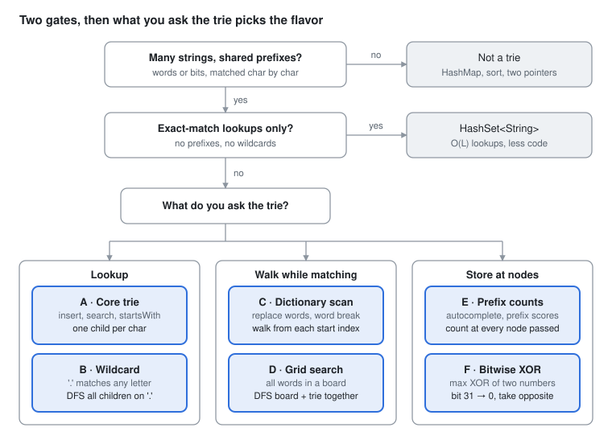

# DSA Prep - Trie

Oct 2, 2026 · Rohit Dhiman · [Source doc](https://claude.ai/artifact/8gMLbnfz9Gc253qfpuLLZQ)

A trie shares prefixes, so every lookup walks one node per character and can stop the moment no word continues. Pick the flavor by **what you ask the trie**.

## Spot it

<picture>
  <source media="(prefers-color-scheme: dark)" srcset="assets/trie-spot-it-dark.svg">
  
</picture>

No shared prefixes means no trie, and exact lookups alone mean a HashSet. Otherwise, what you ask the trie picks A to F.

## The 6 flavors at a glance

| Flavor | Sounds like | What the node stores, then how you walk | Practice |
| --- | --- | --- | --- |
| **A · Core trie** | implement trie<br>starts with<br>longest common prefix | **Stores:** `next[26]` + `end`<br>**Walk:** one child per char | LC 208, 14 |
| **B · Wildcard** | `.` matches any letter<br>add and search words | **Stores:** same as A<br>**Walk:** DFS into every child on `.` | LC 211 |
| **C · Dictionary scan** | replace with shortest root<br>word break<br>stream of characters | **Stores:** `end`<br>**Walk:** from each start index; stop at first end or dead end | LC 648, 139, 720, 1032 |
| **D · Grid search** | find all dictionary words in the board | **Stores:** the full `word` at its end node<br>**Walk:** DFS board and trie together; prune dead branches | LC 212 |
| **E · Prefix counts** | autocomplete<br>count words with prefix<br>sum of prefix scores | **Stores:** `count`, `sum`, or top-3 list<br>**Walk:** update every node passed on insert | LC 1268, 677, 2416, 1804 |
| **F · Bitwise** | maximum XOR of two numbers<br>XOR with limit | **Stores:** `next[2]`<br>**Walk:** bit 31 → 0, prefer the opposite bit | LC 421, 1707 |

## Templates

One node, one walk. Flavors change only what the node stores and when the walk stops.

```
 words: app, apple, apt, bat            (*) = end of a word

            root
           /    \
          a      b
          |      |
          p      a
         / \     |
       p(*) t(*) t(*)
       |
       l
       |
       e(*)

 walk("ap")  → node exists  → startsWith = true, search = false (no *)
 walk("apz") → null          → stop early: nothing continues
```

**The node**

```java
class TrieNode {
    TrieNode[] next = new TrieNode[26];
    boolean end;              // add per flavor: String word; int count; List<String> top;
}
```

**A · Core trie** (LC 208)

```java
TrieNode root = new TrieNode();

void insert(String w) {
    TrieNode cur = root;
    for (char c : w.toCharArray()) {
        int i = c - 'a';
        if (cur.next[i] == null) cur.next[i] = new TrieNode();
        cur = cur.next[i];
    }
    cur.end = true;
}

TrieNode walk(String s) {                     // null if the path breaks
    TrieNode cur = root;
    for (char c : s.toCharArray()) {
        cur = cur.next[c - 'a'];
        if (cur == null) return null;
    }
    return cur;
}

boolean search(String w)     { TrieNode n = walk(w); return n != null && n.end; }
boolean startsWith(String p) { return walk(p) != null; }
```

**B · Wildcard** (LC 211: branch on `.`)

```java
boolean match(TrieNode node, String w, int i) {
    if (node == null) return false;
    if (i == w.length()) return node.end;
    char c = w.charAt(i);
    if (c != '.') return match(node.next[c - 'a'], w, i + 1);
    for (TrieNode child : node.next)
        if (match(child, w, i + 1)) return true;    // try every letter
    return false;
}
// call: match(root, word, 0)
```

**C · Dictionary scan** (LC 648: shortest root)

```java
String shortestRoot(String word) {
    TrieNode cur = root;
    for (int i = 0; i < word.length(); i++) {
        cur = cur.next[word.charAt(i) - 'a'];
        if (cur == null) return word;                    // no root matches
        if (cur.end) return word.substring(0, i + 1);    // first end = shortest
    }
    return word;
}
```

**C+ · Word break** (LC 139: DP, trie stops dead ends early)

```java
boolean[] ok = new boolean[n + 1];
ok[0] = true;
for (int start = 0; start < n; start++) {
    if (!ok[start]) continue;
    TrieNode cur = root;
    for (int j = start; j < n; j++) {
        cur = cur.next[s.charAt(j) - 'a'];
        if (cur == null) break;                 // no word continues: stop
        if (cur.end) ok[j + 1] = true;
    }
}
return ok[n];
```

LC 1032 stream: insert words **reversed**, keep the last `maxLen` chars, walk them newest-first.

**D · Grid search** (LC 212: one DFS, board and trie in lockstep)

```java
// insert stores the full word at its end node: cur.word = w
List<String> res = new ArrayList<>();

void dfs(char[][] b, int r, int c, TrieNode parent) {
    if (r < 0 || c < 0 || r >= b.length || c >= b[0].length) return;
    char ch = b[r][c];
    if (ch == '#') return;                                 // already on the path
    TrieNode node = parent.next[ch - 'a'];
    if (node == null) return;                              // no word continues this way
    if (node.word != null) { res.add(node.word); node.word = null; }   // found, dedupe
    b[r][c] = '#';
    dfs(b, r + 1, c, node);
    dfs(b, r - 1, c, node);
    dfs(b, r, c + 1, node);
    dfs(b, r, c - 1, node);
    b[r][c] = ch;                                          // backtrack
}
// for every cell: dfs(board, r, c, root)
```

**E · Prefix counts** (LC 2416: count at every node passed)

```java
void insert(String w) {
    TrieNode cur = root;
    for (char c : w.toCharArray()) {
        int i = c - 'a';
        if (cur.next[i] == null) cur.next[i] = new TrieNode();
        cur = cur.next[i];
        cur.count++;                          // one more word shares this prefix
    }
}

int score(String w) {
    int total = 0;
    TrieNode cur = root;
    for (char c : w.toCharArray()) {
        cur = cur.next[c - 'a'];
        total += cur.count;
    }
    return total;
}
```

**E+ · Autocomplete** (LC 1268: top 3 stored at each node)

```java
Arrays.sort(products);                        // lexicographic first
for (String p : products) {
    TrieNode cur = root;
    for (char c : p.toCharArray()) {
        int i = c - 'a';
        if (cur.next[i] == null) cur.next[i] = new TrieNode();
        cur = cur.next[i];
        if (cur.top.size() < 3) cur.top.add(p);   // first 3 seen = smallest 3
    }
}
// query: walk searchWord; after each char add cur.top, or an empty list once the path breaks
```

**F · Bitwise trie** (LC 421: max XOR)

```java
class BitNode { BitNode[] next = new BitNode[2]; }
BitNode root = new BitNode();

void insert(int x) {
    BitNode cur = root;
    for (int b = 31; b >= 0; b--) {
        int bit = (x >> b) & 1;
        if (cur.next[bit] == null) cur.next[bit] = new BitNode();
        cur = cur.next[bit];
    }
}

int bestXor(int x) {                          // call only after at least one insert
    BitNode cur = root;
    int res = 0;
    for (int b = 31; b >= 0; b--) {
        int bit = (x >> b) & 1;
        if (cur.next[1 - bit] != null) { res |= 1 << b; cur = cur.next[1 - bit]; }   // opposite bit → 1
        else cur = cur.next[bit];
    }
    return res;
}
// LC 421: insert all, answer = max of bestXor(x)
```

## Why a trie, and node design

A trie wins when you ask about **prefixes**, or when stopping early saves work. For exact lookups only, a `HashSet` is less code. L = word length, n = word count.

| Question | Trie | HashSet | Sorted list |
| --- | --- | --- | --- |
| Is `w` a word? | O(L) | O(L) average | O(L log n) |
| Does any word start with `p`? | O(L) | O(n · L) scan | O(L log n) binary search |
| All words with prefix `p` | O(L + output) | O(n · L) scan | O(L log n + output) |
| Stop as soon as no word continues | yes, built in | no | partly |
| Memory | up to 26 pointers per char inserted | total chars | total chars |

| Children as | Use when | Cost |
| --- | --- | --- |
| `TrieNode[26]` | lowercase `a–z` only (most LC problems) | fastest; 26 slots per node |
| `HashMap<Character, TrieNode>` | mixed case, digits, Unicode | smaller when sparse; slower |
| `TrieNode[2]` | bits of integers (flavor F) | 32 levels for an `int` |

**Complexity to say out loud:** build is O(total chars); each query is O(L), independent of how many words are stored.

## Traps

| Trap | Symptom | Fix |
| --- | --- | --- |
| No `end` flag | "app" found when only "apple" was inserted | `search` checks `node.end`; `startsWith` doesn't |
| `c - 'a'` on uppercase / digits | ArrayIndexOutOfBoundsException | confirm the charset; use `HashMap` children otherwise |
| Wildcard returns too early | misses matches in later branches | return `false` only after trying all 26 children |
| LC 212: searching the board once per word | TLE | one DFS per cell, walking board and trie together |
| LC 212: duplicate results | same word listed twice | set `node.word = null` once found |
| LC 212: forgetting to restore the cell | later paths blocked | `b[r][c] = ch` after the four calls |
| Word break by recursion without memo | exponential time | bottom-up `ok[]` DP; trie only cuts dead ends |
| Autocomplete without sorting first | top 3 aren't the smallest | `Arrays.sort(products)` before inserting |
| XOR query on an empty trie | NPE | insert before querying; LC 1707 sorts queries by limit offline |
| Stream of characters, forward trie | O(n·L) per char | insert reversed words; walk the newest chars first |
