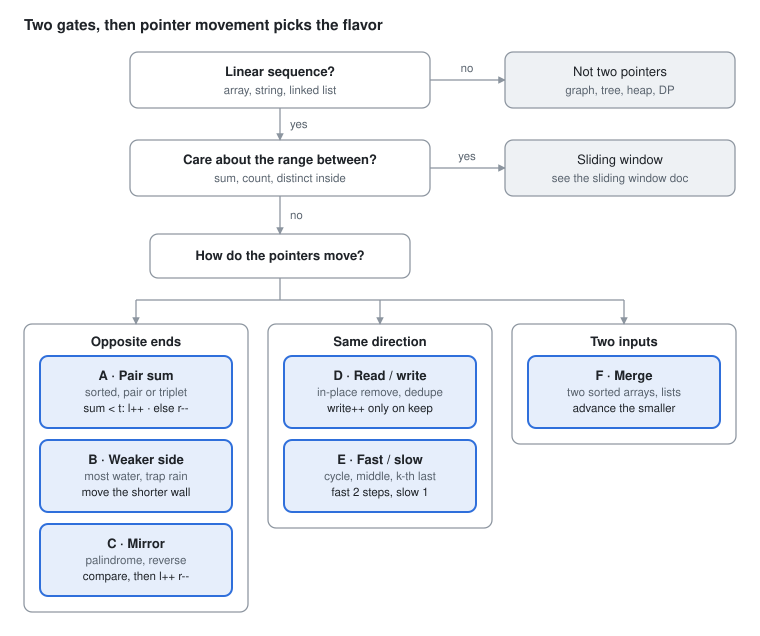

# DSA Prep - Two Pointers

Oct 2, 2026 · Rohit Dhiman · [Source doc](https://claude.ai/artifact/QvHwScD9g9EtNYX1ZyWQpp)

Two indices walk a linear structure so each step safely discards candidates. Pick the flavor by **how the pointers move**.

## Spot it

<picture>
  <source media="(prefers-color-scheme: dark)" srcset="assets/two-pointers-spot-it-dark.svg">
  
</picture>

Range contents point to sliding window. Otherwise, how the pointers move picks A to F.

## The 6 flavors at a glance

| Flavor | Sounds like | Where the pointers start, then the move rule | Practice |
| --- | --- | --- | --- |
| **A · Pair sum** | sorted<br>pair / triplet summing to | **Start:** `l = 0`, `r = n-1`<br>**Move:** sum < t → `l++` · sum > t → `r--` | LC 167, 15, 16, 18, 881 |
| **B · Weaker side** | most water<br>trap rain | **Start:** `l = 0`, `r = n-1`<br>**Move:** move the shorter side | LC 11, 42 |
| **C · Mirror** | palindrome<br>reverse in place | **Start:** `l = 0`, `r = n-1`<br>**Move:** compare, then `l++` `r--` | LC 125, 680, 344, 977 |
| **D · Read / write** | in place<br>remove<br>dedupe<br>move zeros | **Start:** `write = 0`, `read` loops<br>**Move:** `read` always · `write` only on keep | LC 26, 27, 80, 283, 75 |
| **E · Fast / slow** | cycle<br>middle<br>k-th from end | **Start:** both at `head`<br>**Move:** slow 1 step · fast 2 steps (or k-gap) | LC 141, 142, 876, 19, 287 |
| **F · Merge** | two sorted arrays / lists<br>subsequence | **Start:** `i` on a, `j` on b<br>**Move:** advance the smaller | LC 88, 21, 392, 844, 350 |

Range contents (sum / count inside) → not here: see the [sliding window](sliding-window.md) page.

## Templates

Three spines. Only the move rule changes inside each.

```
 OPPOSITE (A·B·C)        SAME DIRECTION (D·E)       TWO INPUTS (F)
 l →            ← r      slow →   fast →→           a: i →
 while (l < r)           for/while fast moves       b: j →
     act on (l, r)           slow moves on rule     while (i < a && j < b)
     move ONE side                                      take smaller, advance it
                                                    drain leftovers
```

**A · Pair sum** (input sorted)

```java
int l = 0, r = n - 1;
while (l < r) {
    int sum = nums[l] + nums[r];
    if (sum == target) return new int[]{l, r};
    if (sum < target) l++;
    else r--;
}
```

**A+ · 3Sum** (anchor i, then A on the rest)

```java
Arrays.sort(nums);
for (int i = 0; i < n - 2; i++) {
    if (i > 0 && nums[i] == nums[i - 1]) continue;          // dup anchor
    int l = i + 1, r = n - 1;
    while (l < r) {
        int sum = nums[i] + nums[l] + nums[r];
        if (sum < 0) l++;
        else if (sum > 0) r--;
        else {
            res.add(List.of(nums[i], nums[l], nums[r]));
            while (l < r && nums[l] == nums[l + 1]) l++;     // dup l
            while (l < r && nums[r] == nums[r - 1]) r--;     // dup r
            l++; r--;
        }
    }
}
```

**B · Weaker side** (LC 11)

```java
int l = 0, r = n - 1, best = 0;
while (l < r) {
    best = Math.max(best, Math.min(h[l], h[r]) * (r - l));
    if (h[l] < h[r]) l++;
    else r--;
}
```

**B+ · Trapping rain water** (LC 42)

```java
int l = 0, r = n - 1, lMax = 0, rMax = 0, water = 0;
while (l < r) {
    if (h[l] < h[r]) { lMax = Math.max(lMax, h[l]); water += lMax - h[l++]; }
    else             { rMax = Math.max(rMax, h[r]); water += rMax - h[r--]; }
}
```

**C · Mirror**

```java
int l = 0, r = s.length() - 1;
while (l < r) {
    if (s.charAt(l) != s.charAt(r)) return false;   // LC 680: try skip l OR skip r, once
    l++; r--;
}
return true;
```

**D · Read / write** (nums[0..write) = answer so far)

```java
int write = 0;
for (int read = 0; read < n; read++) {
    if (keep(read)) nums[write++] = nums[read];
}
return write;   // new length
```

| Problem | keep(read) |
| --- | --- |
| LC 27 remove val | `nums[read] != val` |
| LC 26 dedupe | `write == 0 \|\| nums[read] != nums[write - 1]` |
| LC 80 at most 2 | `write < 2 \|\| nums[read] != nums[write - 2]` |
| LC 283 move zeros | `nums[read] != 0`, then fill rest with 0 |

**E · Fast / slow**

```java
ListNode slow = head, fast = head;
while (fast != null && fast.next != null) {
    slow = slow.next;
    fast = fast.next.next;
    if (slow == fast) return true;   // LC 141 cycle
}
return false;                         // LC 876: return slow (middle)
```

**E+ · k-gap** (LC 19, remove k-th from end)

```java
ListNode dummy = new ListNode(0, head), fast = dummy, slow = dummy;
for (int i = 0; i <= k; i++) fast = fast.next;   // gap = k + 1
while (fast != null) { fast = fast.next; slow = slow.next; }
slow.next = slow.next.next;
return dummy.next;
```

**F · Merge**

```java
int i = 0, j = 0;
while (i < a.length && j < b.length) {
    if (a[i] <= b[j]) out.add(a[i++]);
    else              out.add(b[j++]);
}
while (i < a.length) out.add(a[i++]);   // drain
while (j < b.length) out.add(b[j++]);
```

**F+ · Merge in place from the back** (LC 88)

```java
int i = m - 1, j = n - 1, k = m + n - 1;
while (j >= 0) nums1[k--] = (i >= 0 && nums1[i] > nums2[j]) ? nums1[i--] : nums2[j--];
```

## Why moving is safe

Interviewers ask "why can you skip those?" One line per flavor:

| Flavor | What you discard | Why it is safe |
| --- | --- | --- |
| A · Pair sum | `nums[l]` when sum < t | paired with the largest left (`nums[r]`) it is still too small, so no partner works |
| B · Weaker side | the shorter wall | every other partner is narrower and capped by the same short wall |
| B+ · Rain water | bar at the lower side | the far side already has a wall ≥ it, so only its own-side max bounds the water |
| C · Mirror | the matched pair | mirror positions are checked once; inner range is independent |
| D · Read / write | nothing lost | invariant: `nums[0..write)` is the answer for `nums[0..read)` |
| E · Fast / slow | — | in a cycle fast gains 1 node per step, so it must land on slow; at the end, slow is at half |
| F · Merge | the smaller head | both inputs are sorted, so nothing later in either beats it |

**Complexity:** each pointer moves at most n times → O(n), O(1) extra (sort adds O(n log n)).

## Traps

| Trap | Symptom | Fix |
| --- | --- | --- |
| Pair sum on unsorted input | misses pairs | sort first; if original indices needed (LC 1) → HashMap instead |
| 3Sum duplicates | repeated triplets | skip dup anchor + skip dup `l`/`r` after each hit |
| `l <= r` for pairs | element paired with itself | `l < r` |
| Moving both sides on a miss | skips valid pairs | move exactly ONE side per non-match |
| `fast.next.next` without checks | NullPointerException | `fast != null && fast.next != null`, in that order |
| Deleting the head (k-th from end) | special-case mess | start both at a dummy node |
| Merge forgets leftovers | output too short | drain both inputs after the main loop |
| LC 88 merging from the front | overwrites unread `nums1` | fill from the back |
| `nums[l] + nums[r]` with values ~1e9 | int overflow | cast to `long` |
